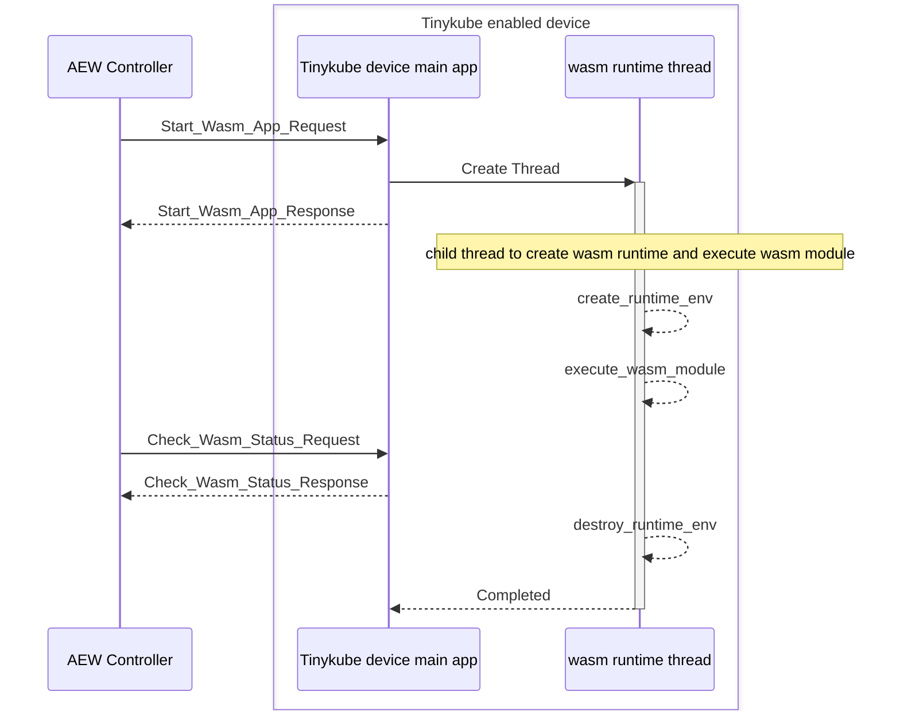
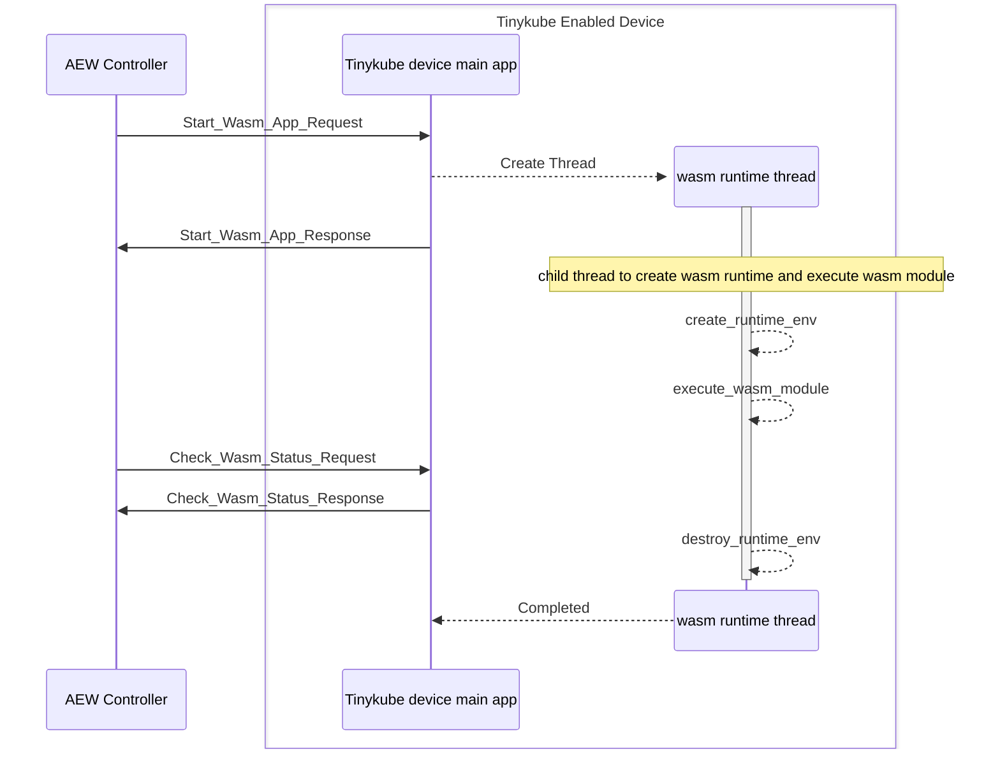

# setup
To generate the c files to handle the protobuf payload, install protobuf-c-compiler and libprotobuf-dev. Note that you only need these to generate the files, running the sample only requires the libprotobuf-c-dev package.
```bash
sudo apt-get install protobuf-c-compiler libprotobuf-dev
```

Then, to generate the files, run:
```bash
# from the root folder
protoc-c --c_out=./scenarios/tinykube_device/protobuf --proto_path=./scenarios/tinykube_device/protobuf StartWasmModuleCommandRequest.proto StartWasmModuleCommandResponse.proto DestroyWamrRuntimeCommandResponse.proto
```
# flowchat



