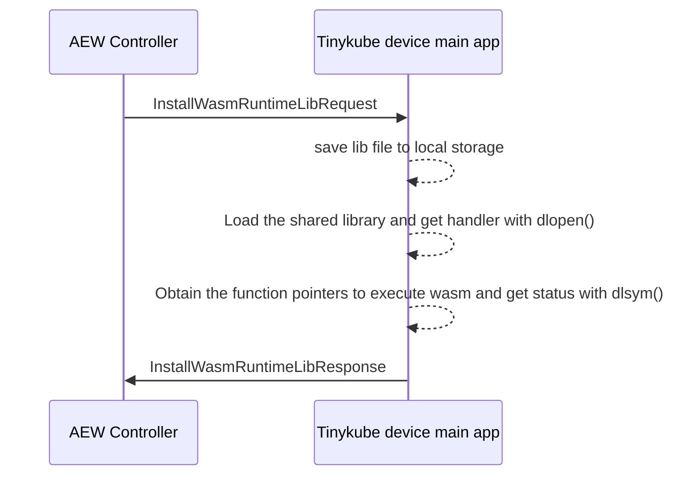
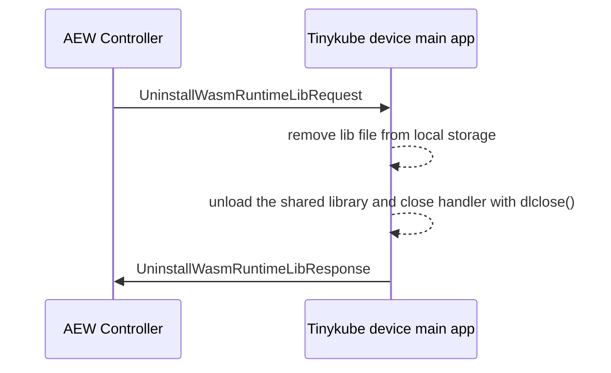
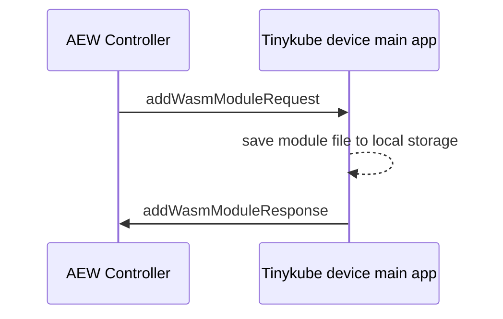
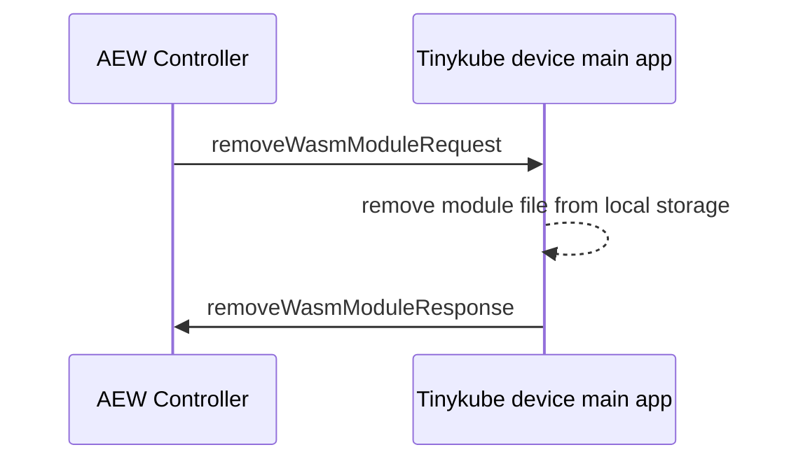
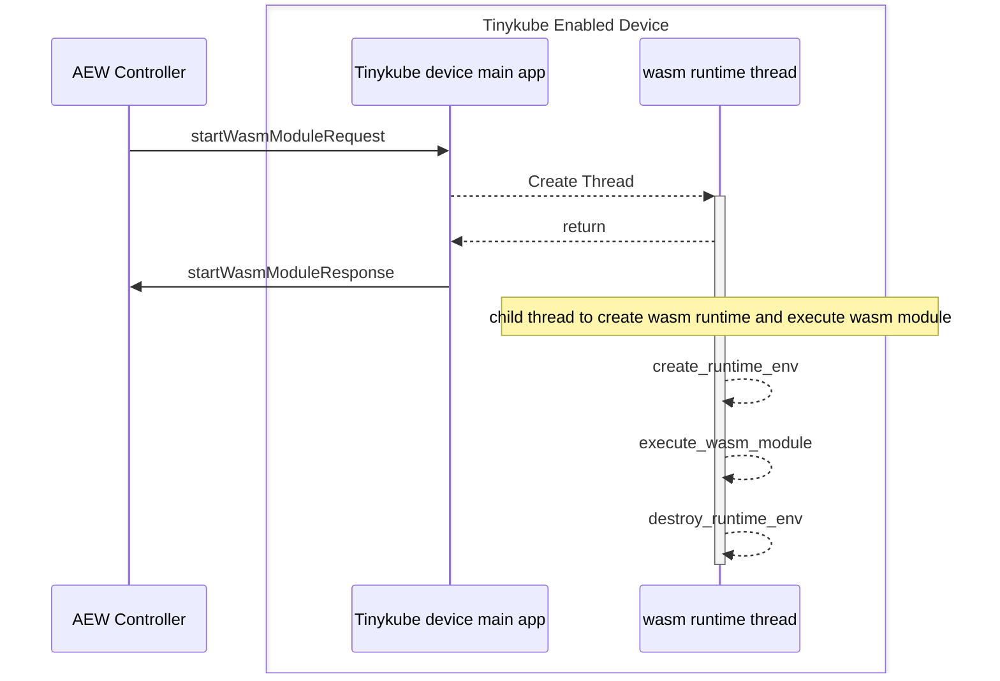
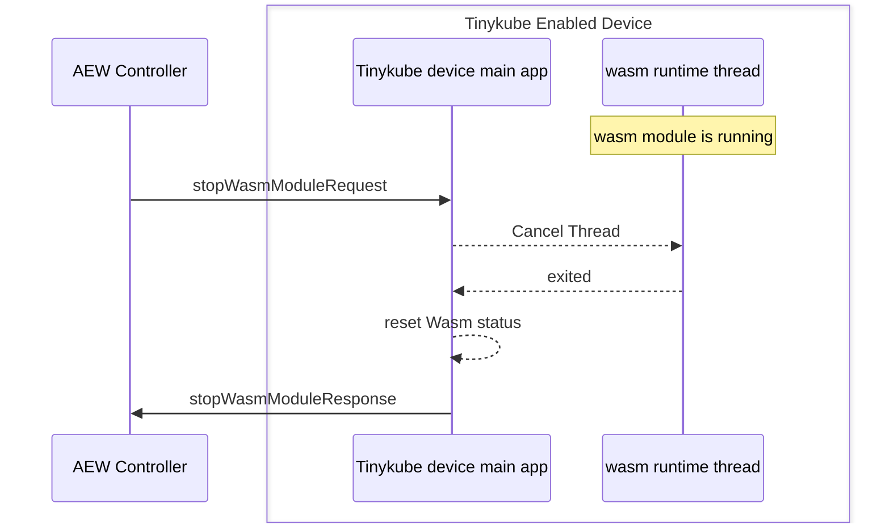
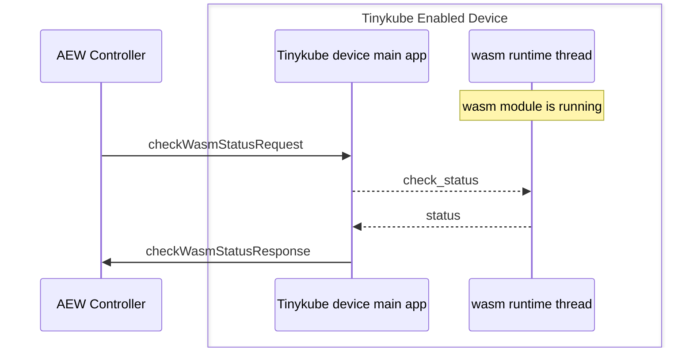

# RPC Spec and flowchat

1. [Install wasm runtime library](#install-wasm-runtime-library)
2. [Uninstall wasm runtime library](#uninstall-wasm-runtime-library)  
3. [Add a wasm module file](#add-a-wasm-module-file)
4. [Remove a wasm module file](#remove-a-wasm-module-file)
5. [Start a wasm module](#start-a-wasm-module)
6. [Stop a wasm module](#stop-a-wasm-module)
7. [check wasm status](#check-wasm-status)

## Install wasm runtime library
```
      {
        "@type": "Command",
        "name": "InstallWasmRuntimeLib",
        "request": {
          "name": "wasmRuntimeLib",
          "schema": {
            "@type": "Object",
            "fields": [
              {
                "@type": [ "Field", "Indexed" ],
                "name": "runtimeLibName",
                "schema": "string",
                "index": 1
              },
              {
                "@type": [ "Field", "Indexed" ],
                "name": "runtimeType",
                "schema": "string",
                "index": 2
              },
              {
                "@type": [ "Field", "Indexed" ],
                "name": "runtimeLibSize",
                "schema": "integer",
                "index": 3
              },
              {
                "@type": [ "Field", "Indexed" ],
                "name": "runtimeLibContent",
                "schema": {
                  "@type": "Array",
                  "elementSchema": "integer"
                },
                "index": 4
              }
            ]
          }
        },
        "response": {
          "name": "result",
          "schema": "integer"
        }
      },

```


## Uninstall wasm runtime library
```
      {
        "@type": "Command",
        "name": "uninstallWasmRuntimeLib",
        "request": {
          "name": "RuntimeLibName",
          "schema": "string"
        },
        "response": {
          "name": "result",
          "schema": "integer"
        }
      },
```



## Add a wasm module file
```
      {
        "@type": "Command",
        "name": "addWasmModule",
        "request": {
          "name": "wasmModule",
          "schema": {
            "@type": "Object",
            "fields": [
              {
                "@type": [ "Field", "Indexed" ],
                "name": "wasmModuleName",
                "schema": "string",
                "index": 1
              },
              {
                "@type": [ "Field", "Indexed" ],
                "name": "wasmModuleSize",
                "schema": "integer",
                "index": 2
              },
              {
                "@type": [ "Field", "Indexed" ],
                "name": "wasmModuleContent",
                "schema": {
                  "@type": "Array",
                  "elementSchema": "integer"
                },
                "index": 3
              }
            ]
          }
        },
        "response": {
          "name": "result",
          "schema": "integer"
        }
      },
```


## Remove a wasm module file
```
      {
        "@type": "Command",
        "name": "removeWasmModule",
        "request": {
          "name": "wasmModuleName",
          "schema": "string"
        },
        "response": {
          "name": "result",
          "schema": "integer"
        }
      },
```



## Start a wasm module
```
      {
        "@type": "Command",
        "name": "startWasmModule",
        "request": {
          "name": "wasmModuleName",
          "schema": "string"
        },
        "response": {
          "name": "result",
          "schema": "integer"
        }
      },
```

      {
        "@type": "Command",
        "name": "stopWasmModule",
        "request": {
          "name": "wasmModuleName",
          "schema": "string"
        },
        "response": {
          "name": "result",
          "schema": "integer"
        }
      },

```


## check wasm status
```
      {
        "@type": "Command",
        "name": "checkWasmStatus",
        "response": {
          "name": "wasmStatus",
          "schema": {
            "@type": "Object",
            "fields": [
              {
                "@type": [ "Field", "Indexed" ],
                "name": "runtimeLibName",
                "schema": "string",
                "index": 1
              },
              {
                "@type": [ "Field", "Indexed" ],
                "name": "wasmModuleName",
                "schema": "string",
                "index": 2
              },
              {
                "@type": [ "Field", "Indexed" ],
                "name": "runtimeState",
                "schema": "string",
                "index": 3
              },
              {
                "@type": [ "Field", "Indexed" ],
                "name": "startingTime",
                "schema": "dateTime",
                "index": 4
              },
              {
                "@type": [ "Field", "Indexed" ],
                "name": "runningTime",
                "schema": "time",
                "index": 5
              }
            ]
          }
        }
      }
```

